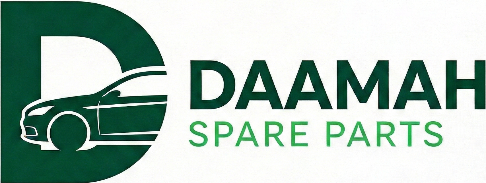

<div align="center">



# Daama Spare Parts Establishment

### Genuine & Aftermarket Parts for German Cars — KSA

[](https://nextjs.org/)
[](https://www.typescriptlang.org/)
[](https://tailwindcss.com/)
[](https://pages.github.com/)
[](LICENSE)

**[🌐 Live Demo](https://mohammadmahmoud.github.io/daama-spare-parts/)** • **[🐛 Report Bug](https://github.com/MohammadMahmoud/daama-spare-parts/issues)** • **[✨ Request Feature](https://github.com/MohammadMahmoud/daama-spare-parts/issues)**

</div>

---

## 📋 Table of Contents

- [Daama Spare Parts Establishment](#daama-spare-parts-establishment)
    - [Genuine \& Aftermarket Parts for German Cars — KSA](#genuine--aftermarket-parts-for-german-cars--ksa)
  - [📋 Table of Contents](#-table-of-contents)
  - [🚗 About The Project](#-about-the-project)
  - [✨ Features](#-features)
  - [🛠 Tech Stack](#-tech-stack)
  - [📁 Project Structure](#-project-structure)
  - [🚀 Getting Started](#-getting-started)
    - [Prerequisites](#prerequisites)
    - [Installation](#installation)

---

## 🚗 About The Project

**Daama Spare Parts Establishment** is a professional static business website for a KSA-based automotive spare parts shop specializing in **BMW**, **Mercedes-Benz**, and **Volkswagen** original and OEM components.

The website is fully **bilingual (English & Arabic)** with proper RTL/LTR layout switching, built as a **static Next.js export** and hosted on **GitHub Pages**.

---

## ✨ Features

- 🌍 **Bilingual** — Full English & Arabic support with RTL layout
- ⚡ **Static Export** — Lightning fast, no server needed
- 📱 **Fully Responsive** — Mobile, tablet, and desktop
- 🎨 **Professional Design** — Corporate dark green theme with glassmorphism UI
- 🔍 **SEO Optimized** — Meta tags, Open Graph, JSON-LD structured data
- 📍 **Google Maps** — Embedded location placeholder
- 📞 **Clickable Contacts** — Phone, WhatsApp, Email, and Maps deep links
- 🚀 **Auto Deploy** — GitHub Actions CI/CD pipeline
- 🏎️ **BMW Focus** — Dedicated BMW parts showcase section

---

## 🛠 Tech Stack

| Technology                                            | Version | Purpose                         |
| ----------------------------------------------------- | ------- | ------------------------------- |
| [Next.js](https://nextjs.org/)                        | 16.x    | React framework with App Router |
| [TypeScript](https://www.typescriptlang.org/)         | 5.x     | Type safety                     |
| [Tailwind CSS](https://tailwindcss.com/)              | v4      | Utility-first styling           |
| [GitHub Actions](https://github.com/features/actions) | —       | CI/CD deployment                |
| [GitHub Pages](https://pages.github.com/)             | —       | Static hosting                  |

---

## 📁 Project Structure

daama-spare-parts/
├── .github/
│ └── workflows/
│ └── deploy.yml # GitHub Actions CI/CD
├── public/
│ ├── logo.png # Company logo
│ └── images/
│ ├── hero-bg.jpg # Hero background
│ ├── engine.jpg
│ ├── brakes.jpg
│ ├── suspension.jpg
│ └── filters.jpg
├── src/
│ ├── app/
│ │ ├── [lang]/
│ │ │ ├── layout.tsx # Language layout (RTL/LTR + SEO)
│ │ │ └── page.tsx # Main page content
│ │ ├── page.tsx # Root redirect → /en
│ │ └── globals.css # Tailwind + custom theme
│ └── components/
│ └── Navbar.tsx # Client component with mobile menu
├── next.config.mjs # Static export config
├── tsconfig.json
└── package.json

---

## 🚀 Getting Started

### Prerequisites

- Node.js `>= 18.x`
- npm `>= 9.x`

### Installation

````bash
# 1. Clone the repo
git clone https://github.com/MohammadMahmoud/daama-spare-parts.git

# 2. Navigate to the project
cd daama-spare-parts

# 3. Install dependencies
npm install

# 4. Run the development server
npm run dev

Open http://localhost:3000 in your browser.

Available Scripts
npm run dev        # Start development server (Turbopack)
npm run build      # Build static export → /out
npm run lint       # Run ESLint
📦 Deployment
This project auto-deploys to GitHub Pages via GitHub Actions on every push to main.

Manual Deployment Steps
bash
# 1. Build the static export
npm run build

# 2. Commit and push to trigger auto-deploy
git add .
git commit -m "feat: your change"
git push origin main
The GitHub Actions workflow will:

Install dependencies

Build the Next.js static export (/out)

Deploy to GitHub Pages automatically

Live URL: https://mohammadmahmoud.github.io/daama-spare-parts/
🌐 Connecting a Custom Domain
Purchase your domain on Namecheap

Go to GitHub Repo → Settings → Pages → Custom domain

Add these DNS records in Namecheap:

Type	Host	Value
A	@	185.199.108.153
A	@	185.199.109.153
A	@	185.199.110.153
A	@	185.199.111.153
CNAME	www	mohammadmahmoud.github.io
Remove basePath from next.config.mjs and push again

🗺 Roadmap
 Bilingual English & Arabic support

 Responsive navbar with mobile menu

 Professional hero section with brand cards

 Product categories with images

 Clickable contact links

 Working hours section

 GitHub Actions deployment

 Google Maps live embed

 WhatsApp floating button

 Contact/quote request form

 Product detail pages

 SEO sitemap generation

📄 License
Distributed under the MIT License. See LICENSE for more information.

<div align="center">
Built with ❤️ for Daama Spare Parts Establishment — KSA
</div> ```
````
